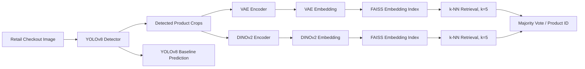

# Automatic Retail Product Checkout

[](https://www.python.org/)
[](https://pytorch.org/)
[](https://docs.ultralytics.com/)
[](https://github.com/facebookresearch/dinov2)

## Overview

This project implements an automatic retail product checkout pipeline for identifying multiple products in cluttered checkout images. The system combines object detection with visual embedding-based retrieval to address cases where products are partially occluded or visually similar.

Three approaches were evaluated: (1) YOLOv8 as a direct detection/classification baseline, (2) YOLOv8 + VAE for embedding-based retrieval, and (3) YOLOv8 + DINOv2 for more discriminative visual embeddings. In the retrieval pipelines, detected product crops are encoded as embeddings and matched against an embedding database using cosine similarity and k-nearest-neighbor retrieval with `k=5`.

The project was implemented in Python using PyTorch and Ultralytics YOLOv8, with experiments performed in the Kaggle notebook environment. The reported experiments used the Retail Product Checkout (RPC) dataset. The final comparison in the project report shows that YOLOv8 + DINOv2 provided the strongest precision/recall/mAP results among the evaluated approaches, while YOLOv8 alone was substantially faster.

> **Project type:** Group academic project  
> **Individual contribution:** [TO BE ADDED] — this repository deliberately does not claim a specific individual contribution that is not documented in the supplied project materials.

## Problem Statement

Retail checkout images may contain many products with clutter, occlusion, viewpoint and lighting changes, and visually similar packaging. A direct classification system can become difficult to maintain when the product inventory changes because new categories may require model retraining.

The project investigates an alternative two-stage formulation: first localize products with YOLOv8, then represent each detected crop as a visual embedding and identify it through similarity search. This allows product identities to be represented in an embedding database rather than relying only on a fixed classification head.

## Objectives

- Detect individual products in multi-product retail images.
- Compare direct YOLOv8 detection/classification with embedding-based retrieval.
- Train a VAE-based product representation for comparison.
- Fine-tune a DINOv2-based visual representation for product retrieval.
- Use cosine similarity and k-nearest-neighbor retrieval (`k=5`) for identification.
- Evaluate the approaches using standard detection and RPC-specific metrics.
- Study the accuracy–inference-speed trade-off of the three approaches.

## Methodology

### 1. Dataset preparation

The project uses the **Retail Product Checkout (RPC)** dataset. The supplied report describes 200 product categories and checkout images containing clutter and occlusion. JSON annotations provide image and bounding-box information.

For YOLOv8 training, the RPC bounding boxes are converted from:

```text
(x, y, width, height)
```

to normalized YOLO format:

```text
(class_id, x_center, y_center, width, height)
```

The supplied YOLO notebook creates train/validation data from `val2019` and samples 5,000 images from `test2019` for the test subset used in that notebook.

### 2. YOLOv8 detection

A pretrained `YOLOv8m` model is fine-tuned for the 200 RPC product categories. The supplied training notebook uses:

- 22 epochs
- image size 800
- batch size 16
- SGD optimizer
- initial learning rate `3e-4`
- momentum `0.9`
- weight decay `0.005`
- 5 warm-up epochs
- backbone freezing of 10 layers

The notebook also uses augmentation settings for lighting, geometric variation, mosaic/mixup/copy-paste and erasing.

At inference, YOLOv8 produces bounding boxes for individual products. These crops become the input to the embedding-based retrieval stages.

### 3. VAE embedding pipeline

A convolutional VAE is trained on cropped product images.

The supplied implementation uses:

- input size: `128 × 128`
- latent dimension: `256`
- convolutional encoder
- convolutional-transpose decoder
- reconstruction loss based on MSE
- KL regularization
- an additional contrastive/product-similarity loss

The encoder mean vector `μ` is used as the product embedding. Embeddings are normalized before cosine-similarity retrieval.

### 4. DINOv2 embedding pipeline

The DINO notebook uses a ViT-S/14 DINOv2 backbone and a student–teacher fine-tuning setup.

The supplied implementation:

- creates two global crops of size `224 × 224`
- creates four local crops of size `98 × 98`
- fine-tunes the last two transformer blocks of the student
- uses a 256-dimensional projection head
- uses DINO distillation loss plus a product-similarity loss
- uses AdamW with learning rate `1e-4`
- trains for 10 epochs
- updates the teacher using momentum `0.996`

During inference, the fine-tuned DINOv2 student produces an embedding for each YOLO-detected product crop.

### 5. Embedding database and retrieval

Detected product embeddings are stored in a FAISS index. The supplied implementation uses an inner-product FAISS index after L2-normalizing embeddings, which corresponds to cosine similarity.

For a query embedding, the system retrieves the top `k=5` neighbors and assigns the product category using majority voting.

### 6. Evaluation

The project evaluates both standard detection metrics and RPC-specific metrics.

Standard metrics reported in the supplied report include:

- Precision
- Recall
- mAP@0.5
- mAP@0.5:0.95
- FPS

RPC-specific metrics include:

- Average Count Difference (ACD)
- mean Category Count Difference (mCCD)
- mean Category Intersection over Union (mCIoU)

## System Architecture / Workflow



The architecture corresponds to the two-stage design described in the report: object localization is performed first, followed by embedding extraction and similarity-based identification for the hybrid pipelines.

## Technologies Used

### Programming
- Python

### Deep Learning
- PyTorch
- Torchvision
- Ultralytics YOLOv8
- DINOv2 / Vision Transformer
- Variational Autoencoder (VAE)

### Computer Vision
- OpenCV
- Pillow
- torchvision transforms

### Retrieval
- FAISS
- Cosine similarity
- k-nearest-neighbor retrieval

### Evaluation / Visualization
- NumPy
- scikit-learn
- Matplotlib
- tqdm

### Compute Environment
The project report states that experiments were conducted in the Kaggle notebook environment using a GPU T4 accelerator.

## Dataset / Input Data

The project uses the **Retail Product Checkout (RPC)** dataset.

The supplied report describes the dataset as containing 200 product categories, single-product images for representation learning, multi-product checkout images for validation/testing, JSON annotations, and difficulty levels including easy, medium and hard.

The dataset should **not** be committed to this repository. Download it separately from the public dataset source cited in the project materials:

**Kaggle:** https://www.kaggle.com/datasets/diyer22/retail-product-checkout-dataset

After downloading, configure the dataset path locally or through the Kaggle environment. Do not commit the complete dataset to GitHub.

Expected high-level layout:

```text
retail-product-checkout-dataset/
├── val2019/
├── test2019/
├── instances_val2019.json
└── instances_test2019.json
```

> The exact dataset contents and filenames should be verified against the downloaded dataset before running the pipeline.

## Implementation

### Dataset conversion

`src/prepare_rpc.py` converts RPC JSON annotations to YOLO-format labels and creates the train/validation/test directory structure used by the YOLO pipeline.

### YOLOv8 training

`src/train_yolo.py` contains the fine-tuning configuration corresponding to the supplied YOLO notebook.

### VAE

`src/vae_model.py` contains the convolutional VAE architecture used in the supplied VAE notebook.

### VAE training

`src/train_vae.py` implements the VAE training objective using reconstruction and product-similarity losses.

### DINOv2 fine-tuning

`src/train_dino.py` contains the student–teacher training structure used in the supplied DINO notebook.

### Embedding retrieval

`src/retrieval.py` provides FAISS index construction and top-k retrieval utilities.

### End-to-end inference

`src/infer.py` combines:

1. YOLOv8 detection
2. product cropping
3. embedding extraction
4. FAISS search
5. majority-vote product identification

The supplied notebooks contain the original Kaggle-oriented training/inference workflow and are retained under `notebooks/`.

## Results

The following values are taken directly from the supplied project report and are **not independently recomputed in this repository**.

### Main comparison

| Metric | YOLOv8 | YOLOv8 + DINOv2 | YOLOv8 + VAE |
|---|---:|---:|---:|
| Precision | 0.777 | **0.815** | 0.788 |
| Recall | 0.784 | **0.818** | 0.793 |
| mAP@0.5 | 0.865 | **0.921** | 0.877 |
| mAP@0.5:0.95 | **0.714** | 0.634 | 0.737 |
| FPS | **28.57** | 3.12 | 4.65 |
| ACD ↓ | 2.87 | 2.87 | **0.13** |
| mCCD ↓ | 0.96 | **0.36** | 0.22 |
| mCIoU ↑ | 65.67 | 63.13 | **66.97** |

These values appear in Table II of the supplied report.

The report also describes the YOLOv8 baseline as achieving approximately `0.866` mAP@0.5 in its precision–recall analysis.

### Interpretation

- **YOLOv8** provides the highest reported inference speed at 28.57 FPS.
- **YOLOv8 + DINOv2** provides the highest reported precision, recall and mAP@0.5 among the three approaches.
- **VAE** provides competitive localization-related metrics in the reported comparison but is less discriminative for visually similar products.
- The embedding-based pipelines introduce a substantial inference-speed cost compared with the YOLOv8-only baseline.

## Key Findings

1. Object detection alone provides a strong baseline for localizing retail products.
2. Embedding-based retrieval provides a more flexible formulation than fixed direct classification for changing product inventories.
3. DINOv2 produced more discriminative product representations than the VAE approach in the reported experiments.
4. The YOLOv8 + DINOv2 pipeline achieved the strongest reported precision/recall/mAP@0.5 results.
5. The improved representation quality comes with a substantial reduction in inference speed.
6. The system remains dependent on YOLOv8 detection: a missed detection prevents the downstream embedding module from identifying that product.

## How to Run

### 1. Clone the repository

```bash
git clone https://github.com/EshaSingh02/automatic-retail-product-checkout.git
cd automatic-retail-product-checkout
```

### 2. Create a virtual environment

```bash
python -m venv .venv
```

Activate it:

**Linux/macOS**
```bash
source .venv/bin/activate
```

**Windows**
```powershell
.venv\Scripts\activate
```

### 3. Install dependencies

```bash
pip install -r requirements.txt
```

For GPU-enabled PyTorch, install the PyTorch build appropriate for your CUDA environment before running the training notebooks/scripts. The exact CUDA build is environment-dependent.

### 4. Download the RPC dataset

Download the dataset from the Kaggle source listed above and set:

```bash
export RPC_DATASET=/path/to/retail-product-checkout-dataset
```

On Windows PowerShell:

```powershell
$env:RPC_DATASET="C:\path\to\retail-product-checkout-dataset"
```

### 5. Prepare YOLO labels

```bash
python -m src.prepare_rpc --rpc-root "$RPC_DATASET" --output-dir data/rpc_yolo
```

### 6. Train YOLOv8

```bash
python -m src.train_yolo --data data/rpc_yolo/rpc.yaml
```

The training configuration follows the settings used in the supplied notebook. Training requires a suitable GPU for practical execution.

### 7. Train the VAE

```bash
python -m src.train_vae \
    --data-dir /path/to/cropped-product-images \
    --output checkpoints/best_vae.pth
```

The cropped-product directory should follow the filename convention expected by the supplied notebook.

### 8. Fine-tune DINOv2

```bash
python -m src.train_dino \
    --data-dir /path/to/cropped-product-images \
    --output checkpoints/dino_rpc_model.pth
```

The DINOv2 workflow uses a pretrained `dinov2_vits14` backbone and the student–teacher setup documented above.

### 9. Build the retrieval index

```bash
python -m src.build_database \
    --rpc-root "$RPC_DATASET" \
    --yolo-checkpoint checkpoints/best.pt \
    --encoder dino \
    --encoder-checkpoint checkpoints/dino_rpc_model.pth \
    --output-dir artifacts/dino_index
```

### 10. Run inference

```bash
python -m src.infer \
    --image /path/to/checkout_image.jpg \
    --yolo-checkpoint checkpoints/best.pt \
    --encoder dino \
    --encoder-checkpoint checkpoints/dino_rpc_model.pth \
    --index artifacts/dino_index/product_embeddings.index \
    --labels artifacts/dino_index/embedding_labels.json
```

> **Important:** The supplied notebooks were developed in Kaggle and contain Kaggle-specific paths and checkpoint locations. The repository scripts are organized to replace those environment-specific paths with command-line arguments. Model weights are intentionally not included.

## Project Structure

```text
automatic-retail-product-checkout/
│
├── README.md
├── requirements.txt
├── .gitignore
├── LICENSE
│
├── data/
│   └── README.md
│
├── src/
│   ├── __init__.py
│   ├── prepare_rpc.py
│   ├── train_yolo.py
│   ├── vae_model.py
│   ├── train_vae.py
│   ├── dino_model.py
│   ├── train_dino.py
│   ├── retrieval.py
│   ├── build_database.py
│   ├── infer.py
│   └── evaluate_rpc.py
│
├── notebooks/
│   ├── 01_dino_training_inference.ipynb
│   ├── 02_vae_training_inference.ipynb
│   └── 03_yolov8_finetuning_inference.ipynb
│
├── results/
│   └── README.md
│
├── figures/
│   └── README.md
│
└── docs/
    └── methodology.md
```

## Limitations

- The complete pipeline depends on successful YOLOv8 detection.
- Visually similar products remain challenging.
- DINOv2 substantially reduces inference speed relative to the YOLOv8-only baseline.
- The supplied implementation was developed and evaluated in a Kaggle environment rather than a production retail system.
- The repository does not include trained model weights or the RPC dataset.
- The reported results are taken from the supplied project report; this repository does not claim that they have been independently reproduced.
- The supplied notebooks contain environment-specific paths that must be replaced when running outside Kaggle.

## Future Work

The project report identifies several possible extensions:

- Improve detection recall so missed products can be recovered.
- Use complementary global retrieval or dense region proposals.
- Optimize FAISS/approximate-nearest-neighbor retrieval for larger embedding databases.
- Explore lightweight transformer models or model compression to reduce inference latency.
- Combine visual embeddings with product metadata such as names, barcodes or descriptions.
- Extend the system toward open-set recognition for previously unseen products.
- Improve robustness under severe occlusion and domain shift.
- Move toward real-time deployment after addressing the accuracy–latency trade-off.

## References

1. Wei, X.-S. et al., **RPC: A Large-Scale Retail Product Checkout Dataset**, CVPR, 2019.
2. Caron, M. et al., **Emerging Properties in Self-Supervised Vision Transformers**, ICCV, 2021.
3. Chen, T. et al., **A Simple Framework for Contrastive Learning of Visual Representations**, ICML, 2020.
4. He, K. et al., **Masked Autoencoders Are Scalable Vision Learners**, CVPR, 2022.
5. Tan, L. et al., **Enhanced Self-Checkout System for Retail Based on Improved YOLOv10**, arXiv:2407.21308, 2024.
6. Ultralytics YOLO documentation: https://docs.ultralytics.com/
7. DINOv2 repository: https://github.com/facebookresearch/dinov2
8. FAISS documentation: https://faiss.ai/


## Author

**Esha Singh**  
M.Tech, Sustainable Energy Engineering  
IIT Kanpur

Individual Contribution: Fine-tuned YOLOv8m on the Retail Product Checkout (RPC) dataset, designed the training configuration and augmentation strategy, and implemented the inference pipeline for retail product detection and evaluation.
